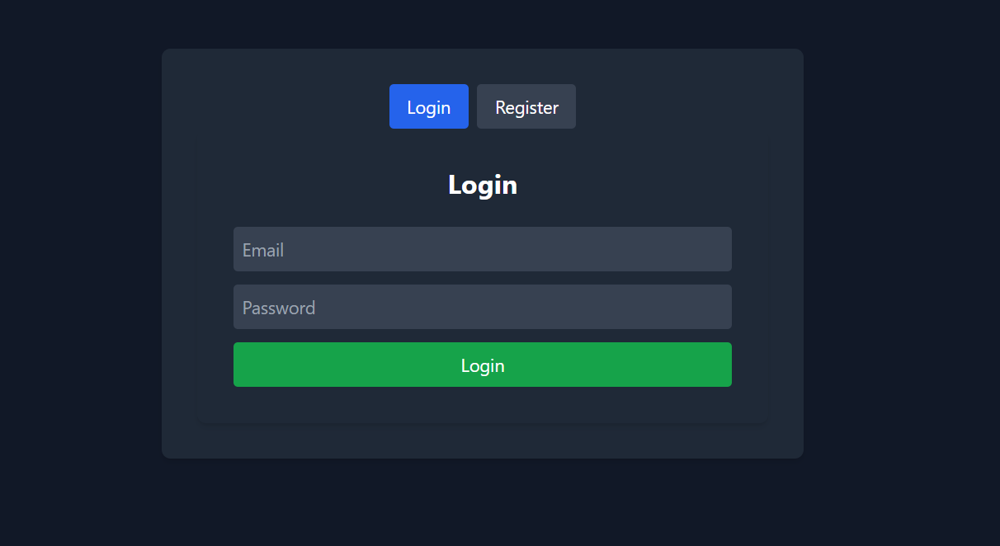
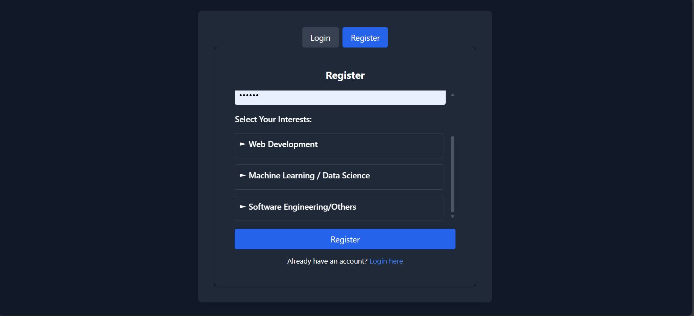
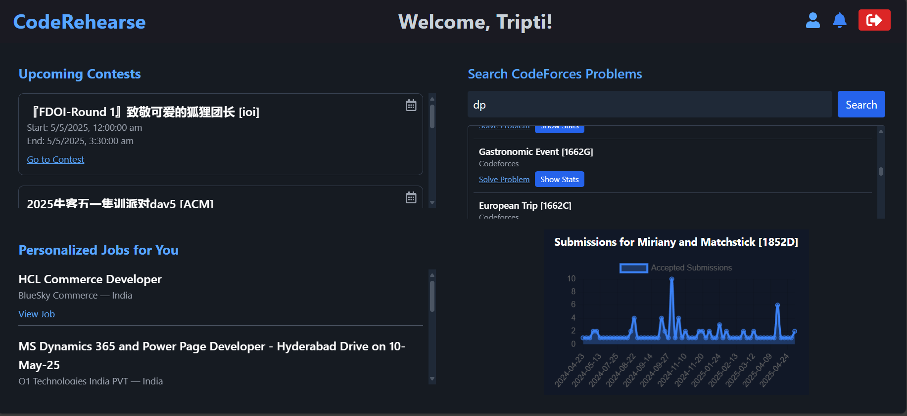

# CodeRehearse

A personalised dashboard for students to track coding contests, get job listings, explore problems, and receive curated newsletter updates.

## Tech Stack

- **Frontend:** React, Tailwind CSS  
- **Backend:** Node.js, Express  
- **Database:** MongoDB  
- **APIs:** CLIST, Jooble, Hacker News  

## Features

- 🎯 Upcoming coding contests from multiple platforms (via CLIST API)  
- 💼 Job listings based on interest (via Jooble API)  
- 📬 Daily newsletter with curated tech articles and opportunities  
- 🔍 Search for problems by tag, with platform filtering  
- 📊 Visualizations for problem-solving stats  

## UI

Login Page


Register Page


Dashboard
  


## 🛠 Setup Instructions

### Backend

```bash
# Clone the repo
git clone https://github.com/tripti8377/CodeReharse.git
cd CodeRehearse/backend

# Install dependencies
npm install

# Start the server
npm start

# Navigate to frontend folder
cd ../frontend

# Install dependencies
npm install

# Start the React app
npm run dev

